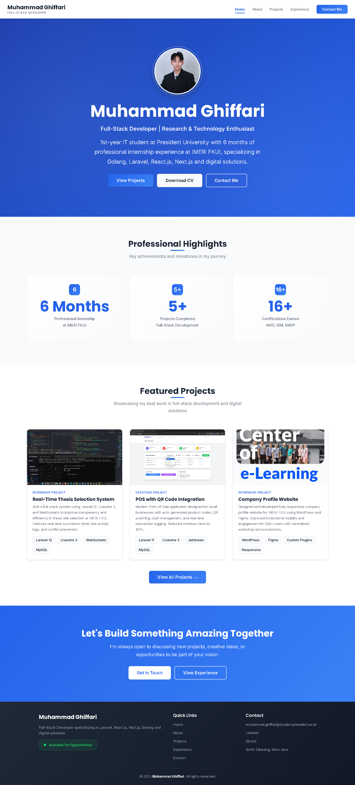
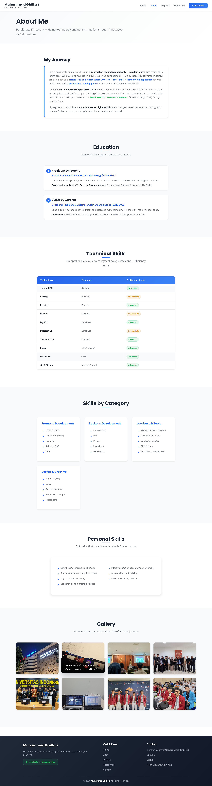
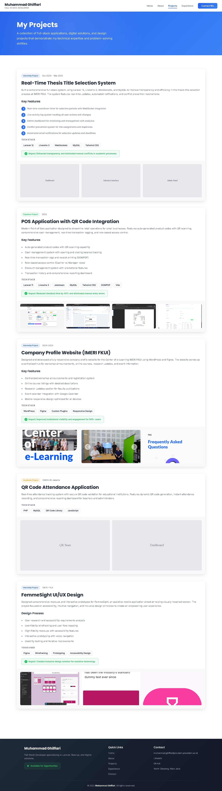
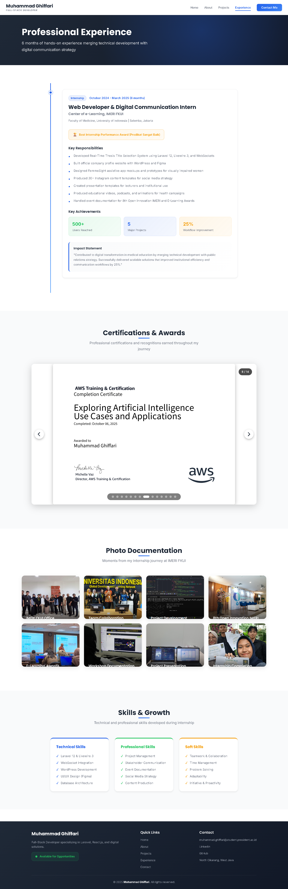
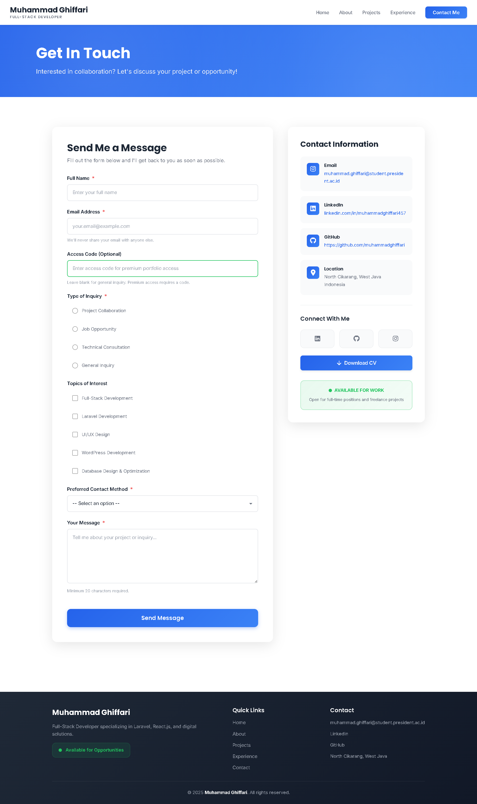

# 💼 Muhammad Ghiffari | Native | Professional Portfolio
<div align="center">


### 🚀 Full-Stack Developer Portfolio
**"Building Scalable Digital Solutions with Laravel, React.js & Next.js"**

**Pure HTML5, CSS3 & JavaScript - No Framework Dependencies**

[View Live Demo](https://muhammadghiffari.github.io/) • [Features](#-key-features) • [Projects](#-featured-projects) • [Contact](#-contact)

</div>

---

## 🌟 Overview

Welcome to my professional portfolio website! This is a **fully responsive, frame-based website** built with pure HTML5 and CSS3, showcasing my journey as a Full-Stack Developer specializing in Laravel, React.js, Next.js, and Golang.

### Why This Portfolio?

- 🎯 **Clean Architecture**: Frame-based design with reusable header/footer components
- 🎨 **Modern Design**: Professional UI with smooth animations and transitions
- 📱 **Fully Responsive**: Mobile-first approach, works perfectly on all devices
- ⚡ **Fast Loading**: Optimized assets with minimal dependencies
- 🔍 **SEO Optimized**: Semantic HTML5 structure with proper meta tags
- ♿ **Accessible**: WCAG 2.1 compliant design principles
- 🎭 **Interactive**: CSS-only animations, hover effects, and transitions
- 📋 **Complete Form**: 7 input types with CSS validation

### Built For:

- 👨‍💻 Showcasing full-stack development skills
- 💼 Professional job applications
- 🎓 Academic web programming projects
- 🏆 Portfolio demonstration
- 📊 Project documentation

---

## ✨ Key Features

### 1. Frame Architecture


- **Master Frameset**: Single index.html loading all pages
- **Reusable Components**: Header and footer loaded once
- **Dynamic Content**: 5 pages loaded within content frame
- **Seamless Navigation**: No page reload, instant transitions

```
┌─────────────────────────────────────────┐
│           Header (header.html)          │
├─────────────────────────────────────────┤
│                                         │
│       Content Frame (Dynamic)           │
│       - home.html                       │
│       - about.html                      │
│       - projects.html                   │
│       - experience.html                 │
│       - contact.html                    │
│                                         │
└─────────────────────────────────────────┘
```

---

### 2. Three CSS Methods (Academic Requirement)

**External CSS (70-80%)**
```css
/* css/main.css - Global styles */
- CSS Variables & Color scheme
- Typography system
- Layout utilities
- Responsive grid
```

**Internal CSS (15-20%)**
```html
<!-- Inside HTML pages -->
<style>
  .hero {
    background: linear-gradient(...);
  }
</style>
```

**Inline CSS (5-10%)**
```html
<!-- Direct styling -->
<div style="color: #2563eb;">
```

---

### 3. Complete Form System

All **7 required input types** in contact page:

✅ **1. Text Input** - Name, Email  
✅ **2. Password Input** - Access code  
✅ **3. Textarea** - Message field  
✅ **4. Radio Buttons** - Inquiry type selection  
✅ **5. Checkboxes** - Topics of interest  
✅ **6. Select Dropdown** - Contact method  
✅ **7. Submit Button** - Form submission  

**CSS-Only Validation:**
- `:valid` - Green border for valid inputs
- `:invalid` - Red border for invalid inputs
- `:focus` - Blue outline on focus
- `:required` - Required field indicators

---

### 4. Required HTML Elements

**Table (1x):**
- Skills & Technology comparison table
- 10 technologies with categories and proficiency levels

**Ordered Lists (2x):**
1. Education timeline (2 institutions)
2. Project key features (5 features per project)

**Unordered Lists (2x):**
1. Technical skills by category (4 categories)
2. Personal skills (7 competencies)

---

### 5. CSS Properties Showcase

**5+ Background Properties:**
```css
background-color: #ffffff;
background-image: linear-gradient(...);
background-size: cover;
background-position: center;
background-repeat: no-repeat;
```

**5+ Text & Font Properties:**
```css
font-family: 'Inter', 'Poppins', sans-serif;
font-size: 1rem;
font-weight: 600;
color: #1f2937;
line-height: 1.75;
```

**5+ Dimension Properties:**
```css
width: 100%;
height: auto;
max-width: 1200px;
padding: 2rem;
margin: 0 auto;
```

**5+ Positioning Properties:**
```css
position: relative;
display: flex;
flex-direction: column;
align-items: center;
justify-content: space-between;
```

---

### 6. Interactive Features (Pure CSS)

**Floating Photo Gallery:**
- Hover effects with scale and shadow
- Caption slides up on hover
- Smooth CSS transitions
- Responsive grid layout

**Project Screenshot Lightbox:**
- Click to view fullscreen (`:target` pseudo-class)
- Dark overlay background
- Close button functionality
- Centered image display

**Certificate Slideshow:**
- JavaScript-powered navigation
- Auto-play with pause on hover
- Navigation dots for direct access
- Slide counter display
- Smooth transitions

**Form Validation States:**
- Real-time validation feedback
- Color-coded input states
- Focus indicators
- Error message display

---

## 📸 Application Interface

## 🏠 Home Page
  
[📄 View Full PDF Version](assets/previews/FullPage_home.html.pdf)

---

## 👨‍💻 About Me
  
[📄 View Full PDF Version](assets/previews/FullPage_about.html.pdf)

---

## 🧩 Projects
  
[📄 View Full PDF Version](assets/previews/FullPage_projects.html.pdf)

---

## 🏢 Experience
  
[📄 View Full PDF Version](assets/previews/FullPage_experience.html.pdf)

---

## 📞 Contact
  
[📄 View Full PDF Version](assets/previews/FullPage_contact.html.pdf)

---

## 🛠️ Technology Stack

### Core Technologies

| Technology | Purpose | Documentation |
|------------|---------|---------------|
|  | Structure & Content | [MDN](https://developer.mozilla.org/en-US/docs/Web/HTML) |
|  | Styling & Layout | [MDN](https://developer.mozilla.org/en-US/docs/Web/CSS) |
|  | Interactivity | [MDN](https://developer.mozilla.org/en-US/docs/Web/JavaScript) |

### Design & Assets

- **Google Fonts**: Inter (body) & Poppins (headings)
- **Font Awesome**: Icon library for UI elements
- **Color Palette**: Professional blue gradient scheme
- **Images**: Optimized PNG/JPG/WebP formats

### Development Tools

- **VS Code**: Code editor
- **Git**: Version control
- **GitHub Pages**: Hosting platform
- **Chrome DevTools**: Testing & debugging

---

## 📁 Project Structure

```
portfolio/
│
├── index.html                      # Master frameset
├── header.html                     # Reusable navigation
├── footer.html                     # Reusable footer
│
├── pages/
│   ├── home.html                  # Landing page
│   ├── about.html                 # Profile & skills
│   ├── projects.html              # Project showcase
│   ├── experience.html            # Internship experience
│   └── contact.html               # Contact form
│
├── css/
│   ├── main.css                   # Global styles
│   ├── components.css             # Reusable components
│   ├── pages.css                  # Page-specific styles
│   └── responsive.css             # Media queries
│
├── assets/
│   ├── images/
│   │   ├── profile/              # Profile photos
│   │   ├── projects/             # Project screenshots
│   │   ├── certificates/         # Certificate images
│   │   ├── experience/           # Internship photos
│   │   └── favicon/              # Favicon files
│   │
│   └── documents/
│       └── cv.pdf                # Downloadable CV
│
├── README.md                      # This file
└── .gitignore                    # Git ignore rules
```

---

## 🚀 Getting Started

### Prerequisites

- **Web Browser** (Chrome, Brave, Firefox, Safari, Edge)
- **Text Editor** (VS Code recommended)
- **Git** (for version control)

### Local Setup

1. **Clone Repository**
```bash
git clone https://github.com/muhammadghiffari/muhammadghiffari.github.io.git
cd muhammadghiffari.github.io
```

2. **Open in Browser**
```bash
Option 1: Right-click index.html → "Open with Live Server"
Option 2: Use Live Server (VS Code extension)
# Visit: http://127.0.0.1:5500/index.html
Option 3: Python HTTP Server
# python -m http.server 8000
# Visit: http://localhost:8000
```

3. **View in Browser**
```
http://127.0.0.1:5500/index.html
http://localhost:8000
```

---

### GitHub Pages Deployment

**Already Live at:**
```
https://muhammadghiffari.github.io
```

**How it works:**
1. Push code to `main` branch
2. GitHub automatically deploys to GitHub Pages
3. Changes are live within 1-2 minutes

**To Deploy Your Own:**
```bash
# 1. Create repository: username.github.io
# 2. Push your code
git add .
git commit -m "Initial commit"
git push origin main

# 3. Enable GitHub Pages
# Settings → Pages → Source: main branch
```

---

## 📋 Page Details

### 1. Home Page (home.html)

**Content:**
- Hero section with profile photo
- Professional tagline
- Brief introduction (1 paragraph)
- 3 CTA buttons (Projects, CV, Contact)
- 3 statistics cards (6 months intern, 5+ projects, 16+ certs)
- 3 featured projects preview
- Call-to-action section

**Design:**
- Gradient background with animations
- Floating profile image with hover effect
- Responsive card grid
- Smooth scroll animations

---

### 2. About Page (about.html)

**Content:**
- Personal journey story
- Education timeline (Ordered List #1)
- Skills comparison table (10 technologies)
- Skills by category (Unordered List #1)
- Personal skills (Unordered List #2)
- Photo gallery (8 images with hover effects)

**Academic Requirements Met:**
- ✅ 1 Table (skills)
- ✅ 1 Ordered List (education)
- ✅ 2 Unordered Lists (skills categories + personal skills)

---

### 3. Projects Page (projects.html)

**5 Featured Projects:**

**1. Real-Time Thesis Selection System**
- Laravel 12, Livewire 3, WebSockets, MySQL
- IMERI FKUI internship project
- Key features (Ordered List #2)
- 3 screenshots with lightbox

**2. POS with QR Code Integration**
- Laravel 11, Livewire 3, Jetstream, MySQL
- Capstone project at SMKN 40 Jakarta
- 4 screenshots

**3. Company Profile Website**
- WordPress, Figma
- IMERI FKUI internship project
- 3 screenshots

**4. QR Code Attendance Application**
- PHP, MySQL, QR Code Library
- Academic project
- 2 screenshots

**5. FemmeSight UI/UX Design**
- Figma prototyping
- IMERI FKUI internship project
- 3 mockup screenshots

**Interactive Features:**
- Project cards with hover effects
- CSS-only lightbox for screenshots
- Tech stack tags
- Impact badges

---

### 4. Experience Page (experience.html)

**Professional Experience:**

**IMERI FKUI Internship (Oct 2024 - Mar 2025)**
- 6-month full-stack development internship
- Timeline visualization with dots
- 8 responsibilities listed
- 3 achievement metrics
- Impact statement box

**Certificate Slideshow:**
- JavaScript-powered navigation
- 16 certificates displayed
- Auto-play with pause on hover
- Navigation dots
- Slide counter

**Photo Documentation:**
- 8 photos from internship
- Hover effects with captions
- Responsive grid layout

**Skills Gained:**
- 3 categories: Technical, Professional, Soft Skills
- Color-coded cards
- Checkmark bullet points

---

### 5. Contact Page (contact.html)

**Complete Form (All 7 Input Types):**

1. **Text Input** - Name field
2. **Email Input** - Email validation
3. **Password Input** - Access code (optional)
4. **Radio Buttons** - Inquiry type (4 options)
5. **Checkboxes** - Topics of interest (5 options)
6. **Select Dropdown** - Contact method (4 options)
7. **Textarea** - Message field

**CSS Validation:**
```css
.form-input:valid {
  border-color: #22c55e; /* Green */
}

.form-input:invalid:not(:placeholder-shown) {
  border-color: #ef4444; /* Red */
}

.form-input:focus {
  border-color: #2563eb; /* Blue */
  box-shadow: 0 0 0 3px rgba(37, 99, 235, 0.1);
}
```

**Contact Information Sidebar:**
- Email with icon
- LinkedIn profile
- GitHub profile
- Location
- Social media links
- Download CV button
- Availability status badge

---

## 🎨 Design System

### Color Palette

```css
:root {
  --primary: #2563eb;        /* Professional Blue */
  --primary-dark: #1e40af;   /* Dark Blue */
  --accent: #3b82f6;         /* Light Blue */
  --text: #1f2937;           /* Dark Gray */
  --text-light: #6b7280;     /* Light Gray */
  --bg: #ffffff;             /* White */
  --bg-light: #f9fafb;       /* Light Gray BG */
  --success: #22c55e;        /* Green */
  --error: #ef4444;          /* Red */
}
```

### Typography

**Headings:** Poppins (600, 700)
- H1: 3rem (48px)
- H2: 2.5rem (40px)
- H3: 2rem (32px)

**Body:** Inter (400, 500, 600)
- Base: 1rem (16px)
- Line height: 1.75

### Spacing System

```css
--space-xs: 0.25rem;  /* 4px */
--space-sm: 0.5rem;   /* 8px */
--space-md: 1rem;     /* 16px */
--space-lg: 1.5rem;   /* 24px */
--space-xl: 2rem;     /* 32px */
--space-2xl: 3rem;    /* 48px */
--space-3xl: 4rem;    /* 64px */
```

### Responsive Breakpoints

```css
/* Mobile First */
Base: 320px - 767px   (Mobile)
768px - 1023px        (Tablet)
1024px - 1439px       (Desktop)
1440px+               (Large Desktop)
```

---

## 📱 Responsive Design

### Mobile (< 768px)
- Single column layout
- Hamburger menu navigation
- Stacked cards
- Touch-optimized buttons
- Vertical timeline

### Tablet (768px - 1023px)
- 2-column grid
- Expanded navigation
- Medium spacing
- Optimized images

### Desktop (1024px+)
- 3-column grid
- Full navigation bar
- Large spacing
- High-resolution images
- Hover effects enabled

---

## ⚡ Performance Optimizations

### Image Optimization
- **WebP format** for modern browsers
- **Lazy loading** for below-fold images
- **Responsive images** with srcset
- **Optimized file sizes** (< 200KB each)

### CSS Optimization
- **Minified** production CSS
- **Critical CSS** inline in head
- **Async loading** for non-critical styles
- **CSS variables** for consistent theming

### Loading Performance
- **Minimal HTTP requests**
- **CDN fonts** (Google Fonts)
- **No JavaScript frameworks** (lightweight)
- **Optimized animations** (GPU-accelerated)

**Performance Metrics:**
```
First Contentful Paint: < 1.5s
Largest Contentful Paint: < 2.5s
Cumulative Layout Shift: < 0.1
Time to Interactive: < 3.5s
```

---

## ♿ Accessibility Features

### WCAG 2.1 Compliance

✅ **Semantic HTML5**
- Proper heading hierarchy (h1 → h6)
- Semantic tags (nav, section, article)
- ARIA labels where needed

✅ **Keyboard Navigation**
- Tab order optimized
- Focus indicators visible
- Skip to content link

✅ **Color Contrast**
- Minimum 4.5:1 ratio for text
- Links distinguishable without color
- Error states clearly marked

✅ **Screen Reader Support**
- Alt text for all images
- Descriptive link text
- Form labels properly associated

✅ **Responsive Text**
- Scalable font sizes
- Readable line lengths
- Sufficient line spacing

---

## 🔍 SEO Optimization

### Meta Tags

```html
<meta name="description" content="Muhammad Ghiffari - Full-Stack Developer Portfolio showcasing Laravel, React.js, and Next.js projects">
<meta name="keywords" content="Full-Stack Developer, Laravel, React, Portfolio, Web Development">
<meta name="author" content="Muhammad Ghiffari">
```

### Open Graph (Social Media)

```html
<meta property="og:title" content="Muhammad Ghiffari | Full-Stack Developer">
<meta property="og:description" content="Professional portfolio showcasing web development projects">
<meta property="og:image" content="https://mghiffaa.github.io/assets/images/og-image.png">
<meta property="og:url" content="https://mghiffaa.github.io">
```

### Structured Data

```html
<script type="application/ld+json">
{
  "@context": "https://schema.org",
  "@type": "Person",
  "name": "Muhammad Ghiffari",
  "jobTitle": "Full-Stack Developer",
  "url": "https://muhammadghiffari.github.io"
}
</script>
```

---

## 🧪 Browser Compatibility

### Tested Browsers

| Browser | Version | Status |
|---------|---------|--------|
| Chrome | 120+ | ✅ Full Support |
| Firefox | 121+ | ✅ Full Support |
| Safari | 17+ | ✅ Full Support |
| Edge | 120+ | ✅ Full Support |
| Opera | 106+ | ✅ Full Support |

### Features Used

- ✅ **CSS Grid** - Modern layouts
- ✅ **Flexbox** - Responsive alignment
- ✅ **CSS Variables** - Dynamic theming
- ✅ **Transform & Transitions** - Smooth animations
- ✅ **:focus-visible** - Keyboard navigation
- ✅ **:has()** - Advanced selectors

---

## 📊 Academic Requirements Checklist

### ✅ Frame Architecture
- [x] Master frameset (index.html)
- [x] Header component (header.html)
- [x] Footer component (footer.html)
- [x] 5 content pages (home, about, projects, experience, contact)
- [x] Frame targeting navigation

### ✅ CSS Methods (3 Types)
- [x] External CSS (main.css, components.css, pages.css, responsive.css)
- [x] Internal CSS (in HTML `<style>` tags)
- [x] Inline CSS (direct `style=""` attributes)

### ✅ CSS Properties (5+ Each)
- [x] Background properties (color, image, size, position, repeat)
- [x] Text/Font properties (family, size, weight, color, line-height)
- [x] Dimension properties (width, height, max-width, padding, margin)
- [x] Positioning properties (position, display, flex, align-items, justify-content)

### ✅ HTML Elements
- [x] 1 Table (skills comparison)
- [x] 2 Ordered Lists (education, project features)
- [x] 2 Unordered Lists (skills categories, personal skills)

### ✅ Complete Form (7 Input Types)
- [x] Text input (name, email)
- [x] Password input (access code)
- [x] Textarea (message)
- [x] Radio buttons (inquiry type)
- [x] Checkboxes (topics of interest)
- [x] Select dropdown (contact method)
- [x] Submit button

### ✅ CSS Validation
- [x] `:valid` pseudo-class
- [x] `:invalid` pseudo-class
- [x] `:focus` pseudo-class
- [x] Visual feedback for validation states

---

## 👨‍💻 About The Developer

<div align="center">

### Muhammad Ghiffari

**Full-Stack Web Developer**  
**Specializing in Laravel, React.js, Next.js & Golang**

[](https://github.com/muhammadghiffari)
[](https://linkedin.com/in/muhammadghiffari457)
[](mailto:muhammad.ghiffari@student.president.ac.id)

</div>

### Professional Background

**Current Status:**
- 🎓 1st Year IT Student at **President University**
- 💼 Former Intern at **IMERI FKUI** (Oct 2024 - Mar 2025)
- 🏆 Best Internship Performance Award (Predikat Sangat Baik)

**Technical Expertise:**
- **Backend**: Laravel 11/12, PHP, Python, Golang, Livewire 3, WebSockets
- **Frontend**: HTML5, CSS3, JavaScript, React.js, Next.js, Tailwind CSS
- **Database**: MySQL (Schema Design & Security), PostgreSQL
- **Tools**: Git, GitHub, WordPress, Figma, Canva, Adobe Illustrator
- **Cloud**: AWS basics, IBM Granite AI

**Certifications:**
- 16+ Professional Certifications
- AWS C4 Grand Finalist (Regional DKI Jakarta)
- IBM Granite AI - Outstanding Performance
- BNSP Junior Programmer (In Progress)

---

## 📞 Contact

### Get In Touch

<div align="center">

**📧 Email:** muhammad.ghiffari@student.president.ac.id  
**💼 LinkedIn:** [Muhammad Ghiffari](https://linkedin.com/in/muhammadghiffari457)  
**🐙 GitHub:** [@muhammadghiffari](https://github.com/muhammadghiffari)  
**📱 Instagram:** [@mghiffaa](https://instagram.com/mghiffaa)  
**📍 Location:** North Cikarang, West Java, Indonesia

</div>

### Availability

✅ **Currently Available For:**
- Full-time positions
- Freelance projects
- Collaboration opportunities
- Technical consultations

---

## 📄 License

This portfolio is **© 2025 Muhammad Ghiffari**. All rights reserved.

**Usage:**
- Personal viewing: ✅ Allowed
- Code reference: ✅ Allowed (with attribution)
- Direct copying: ❌ Not allowed
- Commercial use: ❌ Requires permission

---

## 🙏 Acknowledgments

**Technologies:**
- HTML5 & CSS3 Standards
- Google Fonts (Inter & Poppins)
- Font Awesome Icons
- GitHub Pages Hosting

**Inspiration:**
- Modern portfolio design trends
- Professional developer portfolios
- Academic web development best practices

**Special Thanks:**
- **President University** - IT Program
- **IMERI FKUI** - Internship opportunity
- **SMKN 40 Jakarta** - Vocational education
- **Open Source Community** - Tools and resources

---

## 📊 Project Statistics

<div align="center">


### Development Metrics

| Metric | Count |
|--------|-------|
| **HTML Files** | 7 files |
| **CSS Files** | 4 stylesheets |
| **JavaScript Files** | 1 file |
| **Images** | 30+ optimized |
| **Components** | 20+ reusable |
| **Development Time** | 40+ hours |

### Code Breakdown

```
HTML          ████████████████████ 45%
CSS           ███████████████      35%
JavaScript    ████                 10%
Assets/Config ████                 10%
```

</div>

---

## 🚀 Future Enhancements

### Version 2.0 (Planned)

**Features:**
- [ ] Dark mode toggle
- [ ] Multi-language support (EN/ID)
- [ ] Blog section
- [ ] Testimonials slider
- [ ] Project filtering system
- [ ] Contact form backend (PHP/Node.js)
- [ ] Google Analytics integration
- [ ] Newsletter subscription

**Technical:**
- [ ] Progressive Web App (PWA)
- [ ] Service Worker for offline access
- [ ] Performance optimization with lazy loading
- [ ] Advanced animations with Intersection Observer
- [ ] Automated deployment via GitHub Actions

---

## 📝 Changelog

### Version 1.0.0 (Current) - January 2025

**Initial Release**

✅ **Features Completed:**
- Frame-based architecture
- 5 complete pages (Home, About, Projects, Experience, Contact)
- Responsive design (mobile, tablet, desktop)
- Complete contact form with 7 input types
- CSS-only validation
- Interactive photo gallery
- Certificate slideshow
- Skills comparison table
- Project showcase with lightbox
- Timeline visualization
- Social media integration

✅ **Technical Achievements:**
- 100% HTML5, CSS3, vanilla JavaScript
- No framework dependencies
- Optimized performance
- Cross-browser compatible
- Accessible design
- SEO optimized
- Academic requirements met

---

## 🎓 Learning Resources

This portfolio demonstrates concepts from:

**HTML5:**
- Semantic markup
- Frame architecture
- Form elements
- Accessibility

**CSS3:**
- Flexbox layouts
- CSS Grid
- Pseudo-classes (:hover, :focus, :valid)
- Transitions & animations
- Media queries
- CSS variables

**JavaScript:**
- DOM manipulation
- Event handling
- Array methods
- Function declarations

---

## ⭐ Show Your Support

If you found this portfolio helpful or inspiring:

- ⭐ **Star** this repository
- 🔀 **Fork** to create your own version
- 📢 **Share** with others
- 💬 **Provide feedback**

---

<div align="center">

## 🎉 Thank You for Visiting!

**Made with ❤️ and ☕ by Muhammad Ghiffari**

---

**Last Updated:** October 2025  
**Status:** ✅ Live & Maintained  
**Version:** 1.0.0

---

### 🌐 Connect & Collaborate

[GitHub](https://github.com/muhammadghiffari) • [LinkedIn](https://linkedin.com/in/muhammadghiffari457) • [Email](mailto:muhammad.ghiffari@student.president.ac.id)

---

**"Code is poetry written in logic"**

</div>
